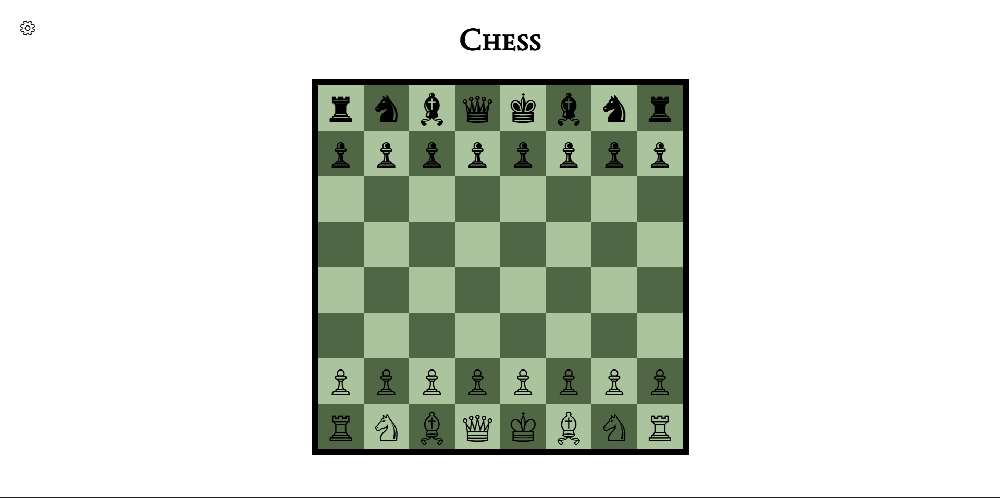

# Chess
Chess is the first big project I created while taking a class in a technical school called OSTC(Oakland Schools Technical Campus) on my senior year in high school. With this project, I learned how to update and create HTML elements using Javascript. \

It is a classic chess game, where the objective of the game is to take down the opponent's king, here is a demonstration: \
 \
For more customization, I added an option to change the board's color: \

